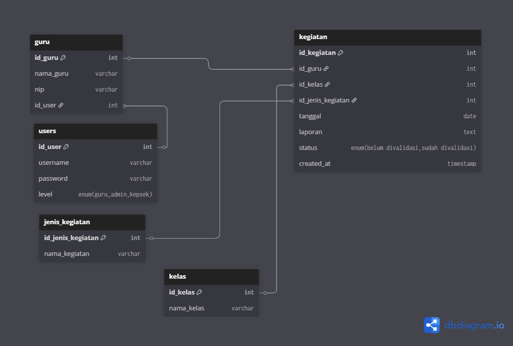
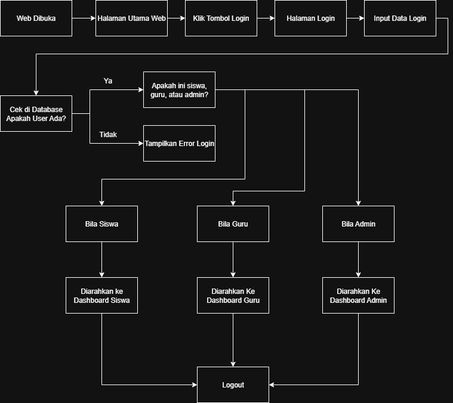

# 📘 Aplikasi Kegiatan Sekolah

Aplikasi ini merupakan project sederhana berbasis web yang bertujuan untuk mempermudah pencatatan dan pengelolaan kegiatan sekolah seperti ekstrakurikuler, upacara, dan lainnya.

---

## 🛠️ Fitur

- ✍️ Input data kegiatan
- 📅 Menampilkan daftar kegiatan
- 📂 Manajemen data siswa
- 🔐 Sistem login sederhana

---

## 🧩 Teknologi yang Digunakan

- PHP Native
- MySQL
- HTML + CSS + JavaScript
- Bootstrap 5

---

## 📐 ERD (Entity Relationship Diagram)

Berikut merupakan diagram relasi antar tabel dalam database:



---

## 🔁 Flowchart Aplikasi

Flowchart berikut menggambarkan alur kerja aplikasi secara umum:



---

## 👨‍💻 Cara Menjalankan Aplikasi

1. Clone repo ini ke `htdocs`:
   ```bash
   git clone https://github.com/username/repo-name.git

2. Buka XAMPP, lalu jalankan **Apache** dan **MySQL**.

3. Buka browser, masuk ke phpMyAdmin: http://localhost/phpmyadmin

4. Buat database baru misalnya: `db_kegiatan_guru`

5. Import file SQL yang ada di folder `database/` (misal `db_kegiatan_guru.sql`)

6. Akses project lewat browser:http://localhost/Aplikasi-Kegiatan-Sekolah

##Role & Permission

| Level   | Hak Akses                                                                 |
|---------|---------------------------------------------------------------------------|
| Admin   | - Kelola akun pengguna (CRUD user)  
          - Kelola data guru, kelas, jenis kegiatan  
          - Lihat semua laporan kegiatan  
          - Full akses ke seluruh fitur aplikasi                                      |
| Guru    | - Input & edit kegiatan harian sendiri  
          - Lihat data kelas yang diajarkan  
          - Lihat laporan kegiatan pribadi                                            |
| Siswa   | - Melihat daftar kegiatan guru di kelasnya  
          - Tidak bisa input, edit, atau hapus data                                   |
