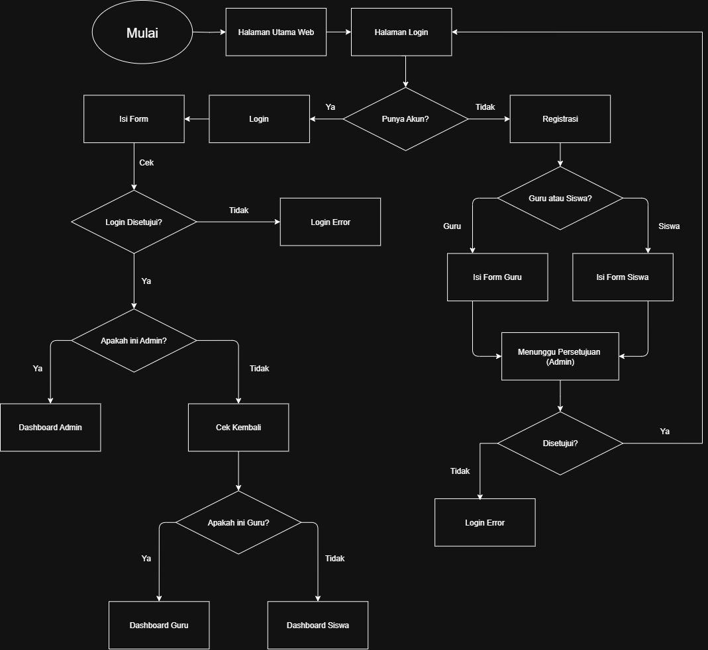

<div align="center">

# Aplikasi Manajemen Kegiatan Guru

[](https://skillicons.dev)

Sebuah aplikasi yang menggunakan template dari **Majestic Admin Dashboard**. Aplikasi ini adalah sistem informasi berbasis web yang dirancang untuk mempermudah pencatatan, pengelolaan, dan pemantauan kegiatan guru di sekolah. Menggunakan sebuah **Role-Based Access**, untuk role-nya ada 3 role yang bisa digunakan, yaitu **Admin**, **Siswa**, **Guru**.

</div>

---

## 📋 Daftar Isi

- [Fitur Utama](#-fitur-utama)
- [Tampilan Aplikasi](#-tampilan-aplikasi)
- [Teknologi yang Digunakan](#-teknologi-yang-digunakan)
- [Dokumentasi Sistem](#-dokumentasi-sistem)
- [Instalasi dan Konfigurasi](#-instalasi-dan-konfigurasi)
- [Peran dan Hak Akses](#-peran-dan-hak-akses)
- [Lisensi](#-lisensi)

---

## ✅ Fitur Utama

- ✍️ **Pencatatan Kegiatan**: Memungkinkan guru untuk memasukkan data kegiatan harian.
- 📊 **Visualisasi Data**: Menampilkan daftar semua kegiatan yang tercatat dalam sistem.
- 👥 **Manajemen Data**: Mengelola informasi siswa dan data master lainnya.
- 🔐 **Sistem Otentikasi**: Dilengkapi sistem login untuk menjaga keamanan data.

---

## 🖥️ Tampilan Aplikasi

Berikut adalah pratinjau desain antarmuka aplikasi yang dirancang menggunakan Figma.

[Figma]((https://www.figma.com/design/kKEC6aooGApoq2rJ27Ck7B/App-Kegiatan-Guru?node-id=29-3&t=aJGjsBzEgKevE8sT-1))

---

## 🛠️ Teknologi yang Digunakan

- **Backend**: PHP Native
- **Database**: MySQL
- **Frontend**: HTML, CSS, JavaScript
- **Framework**: Bootstrap 5

---

## 📊 Dokumentasi Sistem

Dokumentasi teknis mengenai arsitektur dan alur kerja sistem dapat ditemukan di bawah ini.

### 📕 Use Case Diagram
Diagram ini menggambarkan interaksi antara pengguna (aktor) dan sistem.


### 📐 ERD (Entity Relationship Diagram)
Diagram ini menjelaskan struktur dan relasi antar tabel dalam database.


### 🔁 Flowchart Aplikasi
Flowchart ini mengilustrasikan alur kerja proses utama dalam aplikasi.



### 📚 Activity Diagram
Diagram ini merincikan alur aktivitas spesifik yang terjadi dalam sistem.


---

## 🚀 Instalasi dan Konfigurasi

Ikuti langkah-langkah berikut untuk menjalankan aplikasi di lingkungan lokal Anda.

1.  **Clone Repositori**
    Pastikan Anda berada di dalam direktori `htdocs` XAMPP, lalu jalankan perintah:
    ```bash
    git clone https://github.com/AbiSulfur/Aplikasi-Kegiatan-Guru.git
    ```

2.  **Jalankan Server**
    Buka XAMPP Control Panel, lalu jalankan layanan **Apache** dan **MySQL**.

3.  **Setup Database**
    - Buka browser dan akses `http://localhost/phpmyadmin`.
    - Buat database baru dengan nama `db_kegiatan_guru`.
    - Pilih database yang baru dibuat, lalu impor file `.sql` dari direktori `database/`.

4.  **Akses Aplikasi**
    Buka browser Anda dan navigasikan ke `http://localhost/Aplikasi-Kegiatan-Guru`. Selesai! 🎉

---

## 🔐 Peran dan Hak Akses

Sistem ini memiliki tiga jenis peran pengguna dengan hak akses yang berbeda:

| Peran | Hak Akses |
| :--- | :--- |
| 👑 **Admin** | - Mengelola seluruh akun pengguna (CRUD).<br>- Mengelola data master (guru, kelas, jenis kegiatan).<br>- Mengakses seluruh laporan kegiatan.<br>- Memiliki akses penuh ke semua fitur aplikasi. |
| 👨‍🏫 **Guru** | - Mencatat dan mengubah data kegiatan harian pribadi.<br>- Melihat data kelas yang diajar.<br>- Mengakses laporan kegiatan pribadi. |
| 🎓 **Siswa** | - Melihat daftar kegiatan guru di kelasnya.<br>- Tidak memiliki hak untuk menambah, mengubah, atau menghapus data. |

---

## 📜 Lisensi

Proyek ini dilisensikan di bawah [Lisensi MIT](LICENSE).
